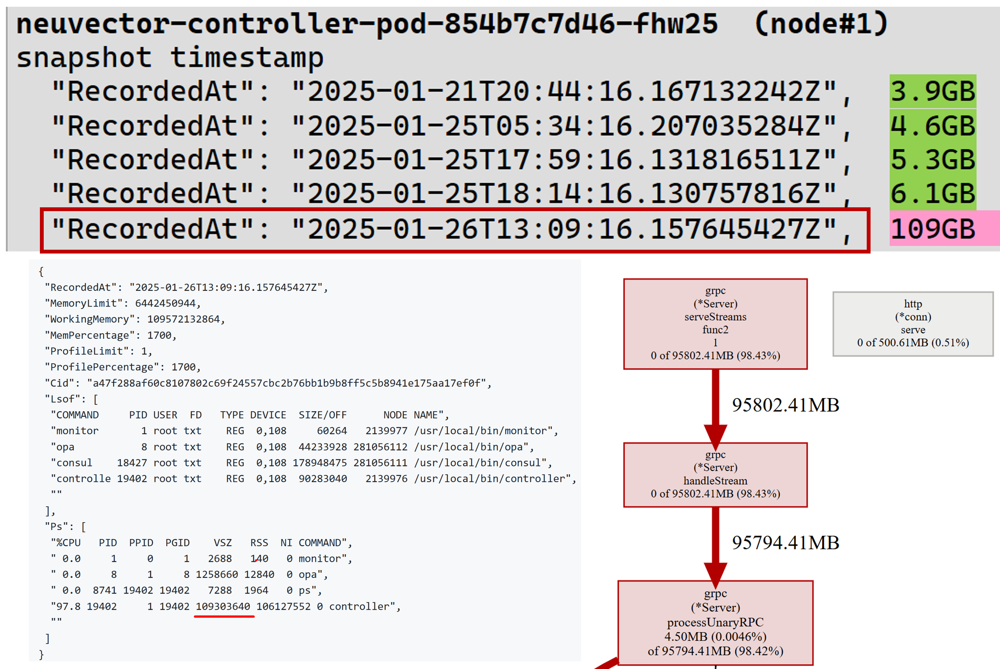

## NVSHAS-9810 NeuVector controller not responding and UI not accessible

### Case description

The customer reported that NeuVector UI is not loading. This is an installation running for a long time and this customer reported before that controller pods got stuck and it is required to scale down and scale up the controller deployment to recover from failure.

### Materias we have

<details><summary>NV pods status</summary>

```
NAME                                                 READY   STATUS             RESTARTS           AGE
neuvector-controller-pod-854b7c7d46-fhw25            1/1     Running            0                  25d
neuvector-controller-pod-854b7c7d46-nktdw            1/1     Running            0                  25d
neuvector-controller-pod-854b7c7d46-rwcxp            1/1     Running            0                  25d

neuvector-enforcer-pod-24526                         0/1     CrashLoopBackOff   1557 (3m33s ago)   25d
neuvector-enforcer-pod-2qj5k                         1/1     Running            8 (8d ago)         25d
neuvector-enforcer-pod-2rlbg                         0/1     CrashLoopBackOff   1281 (19s ago)     25d
neuvector-enforcer-pod-2tc5s                         1/1     Running            4 (12d ago)        25d
neuvector-enforcer-pod-2z5w4                         1/1     Running            4 (10d ago)        25d
neuvector-enforcer-pod-65dld                         1/1     Running            4 (12d ago)        25d
neuvector-enforcer-pod-6nvsn                         1/1     Running            1 (12d ago)        25d
neuvector-enforcer-pod-7vhk9                         1/1     Running            4 (11d ago)        25d
neuvector-enforcer-pod-7x6gr                         1/1     Running            1413 (7m24s ago)   25d
neuvector-enforcer-pod-8bqt7                         0/1     CrashLoopBackOff   1115 (4m52s ago)   25d
neuvector-enforcer-pod-8cg84                         1/1     Running            6 (10d ago)        25d
neuvector-enforcer-pod-8fbms                         1/1     Running            1 (11d ago)        25d
neuvector-enforcer-pod-8m8r2                         1/1     Running            8 (9d ago)         25d
neuvector-enforcer-pod-9647j                         1/1     Running            1262 (7m40s ago)   25d
neuvector-enforcer-pod-cc9dh                         1/1     Running            1168 (6m41s ago)   25d
neuvector-enforcer-pod-dslcf                         1/1     Running            4 (12d ago)        25d
neuvector-enforcer-pod-dzgv7                         1/1     Running            15 (10d ago)       25d
neuvector-enforcer-pod-fn2bg                         1/1     Running            10 (9d ago)        25d
neuvector-enforcer-pod-fnt77                         1/1     Running            4 (10d ago)        25d
neuvector-enforcer-pod-g47xf                         1/1     Running            4 (14d ago)        25d
neuvector-enforcer-pod-h48j2                         1/1     Running            24 (9d ago)        25d
neuvector-enforcer-pod-hgmb6                         1/1     Running            1156 (7m18s ago)   25d
neuvector-enforcer-pod-hww9k                         0/1     CrashLoopBackOff   1354 (109s ago)    25d
neuvector-enforcer-pod-jpd7s                         1/1     Running            9 (10d ago)        25d
neuvector-enforcer-pod-k8ctb                         1/1     Running            2 (13d ago)        25d
neuvector-enforcer-pod-kkrck                         0/1     CrashLoopBackOff   807 (96s ago)      25d
neuvector-enforcer-pod-ljkns                         0/1     CrashLoopBackOff   209 (4m23s ago)    25d
neuvector-enforcer-pod-m5s9n                         1/1     Running            7 (11d ago)        25d
neuvector-enforcer-pod-n94c6                         1/1     Running            1295 (8m12s ago)   25d
neuvector-enforcer-pod-nmtzb                         1/1     Running            13 (9d ago)        25d
neuvector-enforcer-pod-nwhnf                         0/1     CrashLoopBackOff   569 (3m32s ago)    25d
neuvector-enforcer-pod-nzrzh                         1/1     Running            3 (8d ago)         25d
neuvector-enforcer-pod-pjgs7                         1/1     Running            5 (8d ago)         25d
neuvector-enforcer-pod-q2wr8                         0/1     CrashLoopBackOff   1290 (92s ago)     25d
neuvector-enforcer-pod-q4zdt                         1/1     Running            19 (10d ago)       25d
neuvector-enforcer-pod-qdfgv                         1/1     Running            6 (10d ago)        25d
neuvector-enforcer-pod-rtqdj                         1/1     Running            3 (14d ago)        25d
neuvector-enforcer-pod-rx49p                         0/1     CrashLoopBackOff   1349 (101s ago)    25d
neuvector-enforcer-pod-s8f9b                         0/1     CrashLoopBackOff   1297 (39s ago)     25d
neuvector-enforcer-pod-sxblr                         1/1     Running            6 (11d ago)        25d
neuvector-enforcer-pod-t97vz                         1/1     Running            2 (11d ago)        25d
neuvector-enforcer-pod-tn2vd                         1/1     Running            6 (10d ago)        25d
neuvector-enforcer-pod-vhsvj                         1/1     Running            9 (9d ago)         25d
neuvector-enforcer-pod-wcxc2                         1/1     Running            15 (9d ago)        25d
neuvector-enforcer-pod-wvrd5                         1/1     Running            1 (14d ago)        25d
neuvector-enforcer-pod-xvrkm                         1/1     Running            9 (10d ago)        25d
neuvector-enforcer-pod-zjd22                         1/1     Running            16 (10d ago)       25d
neuvector-enforcer-pod-zkvzx                         1/1     Running            5 (8d ago)         25d
neuvector-enforcer-pod-zpsg4                         1/1     Running            1277 (5m21s ago)   25d
neuvector-manager-pod-799bb568f4-24ggs               1/1     Running            0                  25d
neuvector-prometheus-exporter-pod-7f9d79d45d-bqcdz   1/1     Running            0                  25d
neuvector-scanner-pod-86976b45fc-5bgfg               1/1     Running            0                  9h
neuvector-scanner-pod-86976b45fc-dcs4w               1/1     Running            0                  9h
neuvector-scanner-pod-86976b45fc-hnxwd               1/1     Running            0                  9h
neuvector-updater-pod-28972800-75m5s                 0/1     Completed          0                  2d9h
neuvector-updater-pod-28974240-2ct8c                 0/1     Completed          0                  33h
neuvector-updater-pod-28975680-rjlv2                 0/1     Completed          0                  9h
```

-- node#1: neuvector-controller-pod-854b7c7d46-fhw25.log
-- node#2: neuvector-controller-pod-854b7c7d46-nktdw.log
-- node#3: neuvector-controller-pod-854b7c7d46-rwcxp.log


Controller log files (time range)
```
// #1 log time range
2025-01-26T04:50:44.156|INFO|CTL|cache.CacheMethod.MatchK8sAdmissionRules: first image summary - Image=registry-push.idst.ibaintern.de:5002/istio-ipdt/proxyv2:1.22.6-distroless digest= imageID=
(to)
2025-02-03T09:24:45.864Z [ERROR] agent: Coordinate update error: error="No cluster leader"

// #2 log time range
2025-02-03T09:16:11.05 |ERRO|CTL|kv.clusterHelper.AcquireLock: Acquire lock error - error=failed to create session: Unexpected response code: 500 (No cluster leader) key=lock/policy
(to)
2025-02-03T09:24:52.947|ERRO|CTL|rest.(*WebhookServer).validate: cacheAdmCtrlAudit - error=Queue full

// #3 log time range
2025-01-27T14:46:47.791Z [ERROR] agent.server.rpc: rejecting RPC conn from because rpc_max_conns_per_client exceeded: conn=from=10.42.55.36:50201
(to)
2025-02-03T09:24:55.564Z [ERROR] agent.server.rpc: rejecting RPC conn from because rpc_max_conns_per_client exceeded: conn=from=10.42.55.36:53457
```

<details><summary>controller#1 log</summary>

```diff
! Time range: from 2025-01-26T04:50:44 to 2025-02-03T09:24:45.86
! Full log, see below link
```

### full controller#1 log
    [full controller#1 log](./controller_log/1-neuvector-controller-pod-854b7c7d46-fhw25.log)

### excerpt controller#1 log

```
neuvector-controller-pod-854b7c7d46-fhw25.log (node-#1 - check this first)
====================================================
2025-01-26T13:09:02.525|INFO|CTL|cache.AgentAdmissionRequest: Receive connect request - host=q0009381:6596a768-fb27-457f-8c3f-a37b220da290 id=4cafd2b5afb5d9f0c652783ac7c8b5a7e41295b9220d85687a880d9db227e2db
2025-01-26T13:09:02.774|INFO|CTL|cache.AgentAdmissionRequest: Receive connect request - host=q0003320:df3b39de-ca8e-4378-9092-665947d3f873 id=24f3f72d9753c44038a6de5b0a1f9c2a0daca6775e2e4373f04f2759504cb469
2025-01-26T13:09:02.907|INFO|CTL|cache.AgentAdmissionRequest: Receive connect request - host=q0003838:8d69c1bb-9e4f-409a-833f-1e094b83e862 id=6dcbd878342919c72f61f2b40434384198ee273001e5031a2d52c579d3ea44bd
2025-01-26T13:09:04.439|INFO|CTL|cache.AgentAdmissionRequest: Receive connect request - host=q0003322:a38626a4-a970-431f-b66d-465829643591 id=91221f7ce111344774649459e3dacaace11229cb34483091353e72fd020f6bd5
.... 🟢 (28034 hits) "cache.AgentAdmissionRequest: Receive connect request", then different kind of error start to occur

2025-01-26T13:09:13.061Z [ERROR] agent.server.raft: peer has newer term, stopping replication: peer="{Nonvoter e502f51a-8d52-6c56-1869-76bb11b32c51 10.42.55.36:18300}"
2025-01-26T13:09:15.004|INFO|CTL|cluster.StartCluster.func2: Lead elected - lead=10.42.60.190:18300
2025-01-26T13:09:15.771|INFO|CTL|cluster.StartCluster.func1: - newLead=10.42.60.190 oldLead=
2025-01-26T13:09:16.161|INFO|CTL|utils.PerfSnapshot.func1: - at=2025-01-26 13:09:16.157645427 +0000 UTC m=+422425.720579844 label=p memLimit=6442450944 pid=1 prefix=ctl. profileLimit=1 workFolder=/var/nv_debug/snapshot/a47f288af60c8107802c69f24557cbc2b76bb1b9b8ff5c5b8941e175aa17ef0f workingSet=109572132864   🔴 🔴 perf snapshot available 🔴 🔴 
2025-01-26T13:09:16.163|INFO|CTL|system.(*SystemTools).CGroupMemoryStatReset: - threshold=4831838208 usage=109572907008
2025-01-26T13:09:20.055Z [ERROR] agent.http: Request error: method=GET url="/v1/kv/lock/policy?consistent=&index=710787498" from=127.0.0.1:40852 error="node is not the leader"
2025-01-26T13:09:19.946|INFO|CTL|cluster.StartCluster.func1: - newLead= oldLead=10.42.60.190
2025-01-26T13:09:24.07 |INFO|CTL|cluster.StartCluster.func2: Lead loss detected
2025-01-26T13:09:24.544|INFO|CTL|cluster.StartCluster.func2: Cannot locate lead - join=neuvector-svc-controller.neuvector
2025-01-26T13:09:24.556|INFO|CTL|cluster.StartCluster.func2: Retry join - JoinAddr=[10.42.57.244 10.42.55.36 10.42.60.190]
2025-01-26T13:09:24.562Z [ERROR] agent.http: Request error: method=PUT url=/v1/agent/join/10.42.57.244 from=127.0.0.1:36218
  error=
  | 1 error occurred:
  | \t* Failed to join 10.42.57.244:18301: dial tcp 10.42.57.244:18301: connect: connection refused
  | 
  
2025-01-26T13:09:24.568|ERRO|CTL|cluster.(*consulMethod).Join: - error=Unexpected response code: 500 (1 error occurred:
    * Failed to join 10.42.57.244:18301: dial tcp 10.42.57.244:18301: connect: connection refused

) ip=10.42.57.244

...
2025-01-26T13:09:39.2  |INFO|CTL|cache.AgentAdmissionRequest: Receive connect request - host=q0010439:1b2cb03a-65e9-4ea3-bcef-bb12683b6a74 id=d4396a287e353c3e6be5e5a327e5ff7ef8fdfc685313faf750dd7da72e90b4a0
2025-01-26T13:09:39.665Z [ERROR] agent.server.raft: peer has newer term, stopping replication: peer="{Voter e502f51a-8d52-6c56-1869-76bb11b32c51 10.42.55.36:18300}"
2025-01-26T13:09:39.783Z [ERROR] agent.server: failed to reconcile member: member="{10.42.62.190 10.42.62.190 18301 map[build:1.20.1:920cc7c6 dc:neuvector id:00df7fd4-4125-8ce9-adaf-e2dbec831063 role:node segment: vsn:2 vsn_max:3 vsn_min:2] left 1 5 2 2 5 4}" partition=default error="leadership lost while committing log"
2025-01-26T13:09:41.126|INFO|CTL|cache.AgentAdmissionRequest: Receive connect request - host=q0002707:4fdbd2de-49d3-4465-9e57-b14c8603a143 id=1b5d126b3a9989b0dada9ed49411063b152ee274ad212978617525223bb5de57

2025-01-26T13:09:43.178|INFO|CTL|cluster.StartCluster.func2: Cannot locate lead - join=neuvector-svc-controller.neuvector
2025-01-26T13:09:43.364|INFO|CTL|cluster.StartCluster.func2: Retry join - JoinAddr=[10.42.55.36 10.42.57.244 10.42.60.190]

2025-01-26T13:09:52.288|INFO|CTL|utils.PerfSnapshot.func1: - package=/var/nv_debug/snapshot/ctl.snapshot.a47f288af60c8107802c69f24557cbc2b76bb1b9b8ff5c5b8941e175aa17ef0f.p.zip
2025-01-26T13:09:52.291|INFO|CTL|utils.PerfSnapshot.func1: done

2025-01-26T13:09:53.215Z [ERROR] agent.http: Request error: method=PUT url=/v1/agent/join/10.42.57.244 from=127.0.0.1:42838
  error=
  | 1 error occurred:
  | \t* Failed to join 10.42.57.244:18301: dial tcp 10.42.57.244:18301: connect: connection refused
  | 
  
2025-01-26T13:10:24.255Z [ERROR] agent.server: yamux: keepalive failed: i/o deadline reached
2025-01-26T13:10:24.364Z [ERROR] agent.server: yamux: Failed to write header: write tcp 10.42.60.190:18300->10.42.67.107:46095: use of closed network connection
2025-01-26T13:10:24.364Z [ERROR] agent.server: yamux: Failed to write header: write tcp 10.42.60.190:18300->10.42.69.231:51591: use of closed network connection


2025-01-26T13:10:27.760Z [ERROR] agent.server: yamux: keepalive failed: connection write timeout
2025-01-26T13:10:27.762Z [ERROR] agent: yamux: Failed to write header: write tcp 10.42.60.190:40453->10.42.55.36:18300: use of closed network connection
2025-01-26T13:10:30|MON|Process ctrl exit status -1, pid=19402   ❌❌❌

2025-01-26T13:10:40.699Z [ERROR] agent.server: error performing anti-entropy sync of federation state: error="context canceled"
2025-01-26T13:10:47.364Z [ERROR] agent.server: error performing anti-entropy sync of federation state: error="context canceled"

( 🟢 start looping 🅰️ => 🅱️...)
2025-02-02T22:20:02.759Z [ERROR] agent: Coordinate update error: error="No cluster leader"
2025-02-02T22:20:06.935Z [ERROR] agent.server.rpc: rejecting RPC conn from because rpc_max_conns_per_client exceeded: conn=from=10.42.55.36:46317
2025-02-02T22:20:12.254Z [ERROR] agent.server.rpc: rejecting RPC conn from because rpc_max_conns_per_client exceeded: conn=from=10.42.55.36:38839
2025-02-02T22:20:20.871Z [ERROR] agent.server.rpc: rejecting RPC conn from because rpc_max_conns_per_client exceeded: conn=from=10.42.55.36:35543
( 🟢 repeated...) (88736 hits)

```


### Perf Snapshot

Controller process exist one minute after perf snapsho was taken..

```
2025-01-26T13:09:16.161|INFO|CTL|utils.PerfSnapshot.func1: - at=2025-01-26 13:09:16.157645427 +0000 UTC m=+422425.720579844 label=p memLimit=6442450944 pid=1 prefix=ctl. profileLimit=1 workFolder=/var/nv_debug/snapshot/a47f288af60c8107802c69f24557cbc2b76bb1b9b8ff5c5b8941e175aa17ef0f workingSet=109572132864   🔴 🔴 perf snapshot available 🔴 🔴 

2025-01-26T13:10:30|MON|Process ctrl exit status -1, pid=19402   ❌❌❌

```

<p align="center">
  
</p>

</details>


### Findings


### Plans